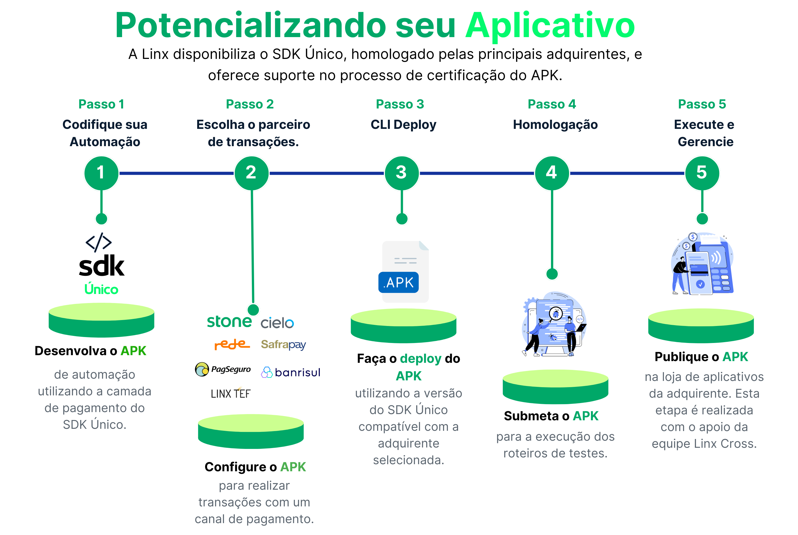

# SDK Único

O SDK Único é uma plataforma completa de integração para Android, que permite aos desenvolvedores construir, implantar, gerenciar e escalar a camada de pagamento das automações em dispositivos Smart Android das adquirentes.
## Visão da Solução

O SDK Único atualmente oferece suporte para as seguintes operações.

{ loading=lazy }

  [Visão da Solução]: assets/images/visao-solucao.png
  

## Operações Disponíveis por SDK

A seguinte tabela resume as operações disponíveis para cada SDK de adquirente integrado ao SDK Único.

| Operação   |  TEF      | Stone | Rede  |  PagSeguro  | GetNet  | Cielo | Adyen | Vero  | Sicoob  |
|------------|-----------|-------|-------|-------------|---------|-------|-------|-------|---------|
| Ativar     |  ✔️        |   ✔️   |   ✔️   |       ✔️     |   ✔️     |   ✔️   |   ✔️   |   ✔️   |   ✔️     |  
| Crédito    |  ✔️        |   ✔️   |   ✔️   |       ✔️     |   ✔️     |   ✔️   |   ✔️   |   ✔️   |   ✔️     |
| Débito     |  ✔️        |   ✔️   |   ✔️   |       ✔️     |   ✔️     |   ✔️   |   ✔️   |   ✔️   |   ✔️     |
| Voucher    |  ✔️        |   ✔️   |   ✔️   |       ❌    |   ✔️     |   ✔️   |   ✔️   |   ✔️   |   ❌    |
| PIX        |  ✔️        |   ✔️   |   ❌  |       ❌    |   ✔️     |   ✔️   |   ✔️   |   ✔️   |   ✔️     |
| Wallet     |  ❌       |   ❌  |   ❌  |       ❌    |   ❌    |   ❌  |   ❌  |   ✔️   |   ❌    |
| Cancelar   |  ✔️        |   ✔️   |   ✔️   |       ✔️     |   ✔️     |   ✔️   |   ✔️   |   ✔️   |   ✔️     |
| Imprimir   |  ✔️        |   ✔️   |   ✔️   |       ✔️     |   ✔️     |   ✔️   |   ✔️   |   ✔️   |   ✔️     |
| Reimprimir |  ✔️        |   ✔️   |   ✔️   |       ✔️     |   ✔️     |   ✔️   |   ✔️   |   ✔️   |   ✔️     |
| Localizar transação |  ✔️        |   ❌   |   ❌   |       ❌     |   ❌     |   ❌   |   ❌   |   ❌   |   ❌     |

- "✔️" indica que a operação é suportada pelo SDK.
- "❌" indica que a operação não é suportada pelo SDK.

Esta tabela facilita a visualização das funcionalidades oferecidas por cada adquirente através do SDK Único.

[Visão da Solução]: assets/images/visao-solucao.png

## Adquirentes Integradas

- Stone
- Linx TEF
- Rede
- GetNet
- Cielo
- PagSeguro
- Adyen
- Vero
- Sicoob

## Dispositivos Suportados

- Sunmi P2-B
- Gertec GPOS 700
- Gertec GPOS 700X
- Positivo L300
- Positivo L400
- APOS A8
- Verifone X990
- Ingenico DX8000
- Saturn S1F2

!!! Atenção 

    Verificar detalhes na sessão [Pré-requisitos](./requisitos.md/#versoes-android-dos-terminais) para Integação com o SDK Único.
