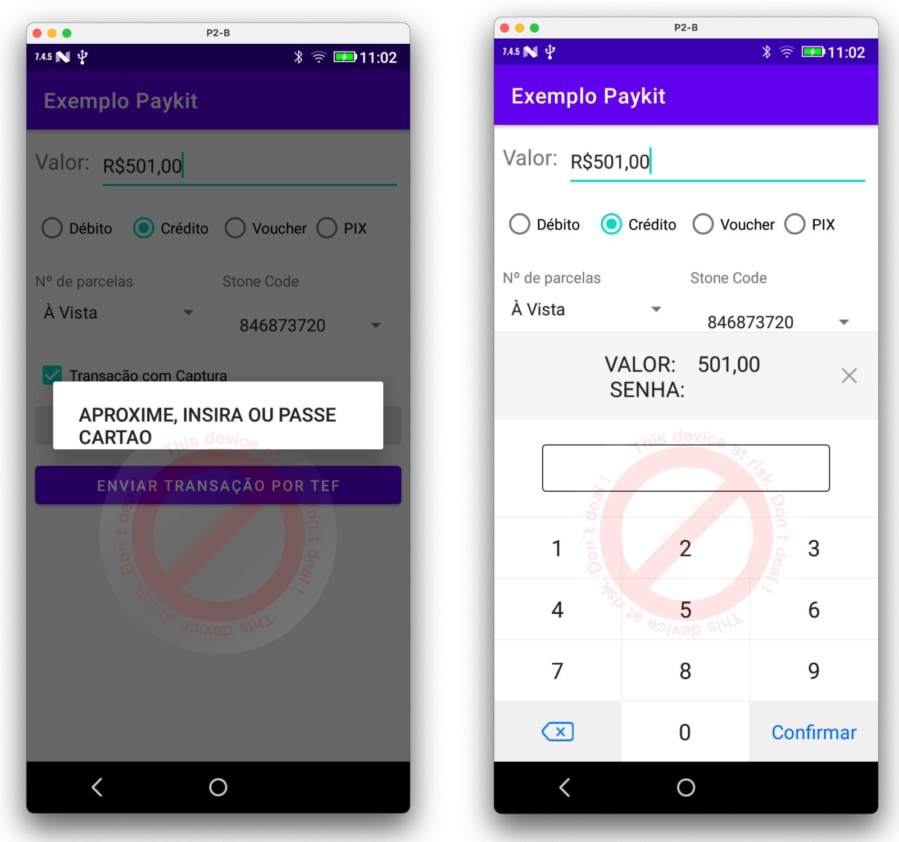

# Projeto Exemplo

Para realizar testes com o SDK Único, é preciso selecionar com qual SDK deseja realizar a transação. 
Para tal, disponiblizamos uma App de Exemplo com flavors específica adquirente.

{ loading=lazy, width="500" }

| SDK                 | Versão SDK Único     | Link                                                                                                                 |
| ------------------- | ---------------------| ---------------------------------------------------------------------------------------------------------------------|
| `Aplicativo Demo`   | 1.1.1                | [Download](https://paykitlinxmobile.github.io/PayKitSdkUnico.github.io/assets/demo/SDKPayServicesDemoApp.zip)        |
| `Aplicativo Demo`   | 1.1.2                | [Download](https://paykitlinxmobile.github.io/PayKitSdkUnico.github.io/assets/demo/SDKPayServicesDemoApp_1.1.2.zip)  |
